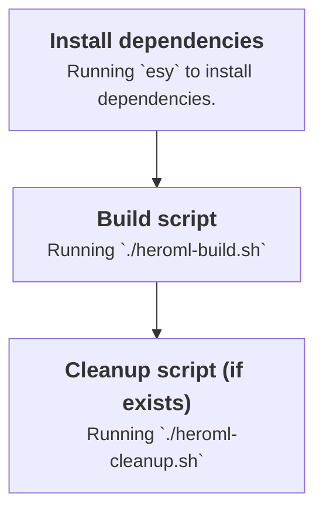

# Heroku Buildpack for Ocaml

> **In Development** 🛠️

> Based on the official Node.js buildpack

## Pipeline

- Running `esy` to install dependencies
- Running `bash ./heroml-build.sh`
  - needs to be defined by the user, example of such file [here](./heroml-build.example.sh)
- ...
- Running `bash ./heroml-cleanup.sh` (if it exists)

